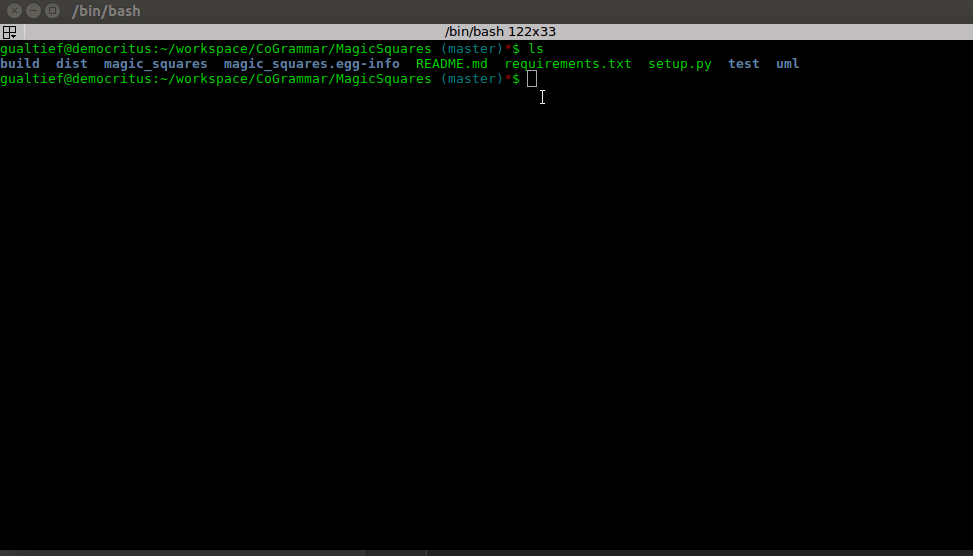

<!-- START doctoc generated TOC please keep comment here to allow auto update -->
<!-- DON'T EDIT THIS SECTION, INSTEAD RE-RUN doctoc TO UPDATE -->
**Table of Contents**

- [Magic Square Generator](#magic-square-generator)
  - [Overview](#overview)
  - [Running Tests](#running-tests)
  - [Running the App](#running-the-app)
  - [Installing the App](#installing-the-app)

<!-- END doctoc generated TOC please keep comment here to allow auto update -->

# Magic Square Generator

<kbd></kbd>

## Overview

This project implements a [magic square](https://en.wikipedia.org/wiki/Magic_square#) generator in Python.

I reckoned that this would be a good opportunity to show my TDD skills in action. The project is a hybrid of structured and object-oriented design, the command-line app being structured, but using objects as components.

The primary components are 'Prompt' and 'Square'. 'Prompt' simply captures the input from the user ('N' or the order of the magic square to be generated) and validates it. If the input is not a valid odd number, an exception is thrown.

The app will keep asking for an input from the user, until a valid odd number is provided.

Note the method 'step_once()' from 'Square'. This method executes a single iteration (step) described in the requirements.

This makes this project a perfect showcase for TDD development, given that every single one of the steps from the requirements can be made into a test case.

Here are they:

1)

     test_step_and_gone_off_on_top_of_the_grid_first()
2)

     test_step_and_gone_off_on_the_left_of_the_grid_first()
3)

     test_step_and_bump_on_existing_number()
4)

     test_step_diagonally_first()
5)

     test_step_diagonally_second(self)
6)

     test_step_and_gone_off_the_edge_of_the_grid()
7)

     test_step_and_gone_off_on_the_left_of_the_grid_second()
8)

     test_step_and_gone_off_on_top_of_the_grid_second()

The test methods were named to reflect the step descriptions from the requirements.

These tests were created exactly in this order, each test completed after a full red-green-refactor cycle, that is:

- Add a test.
- Add stubs to production code so project compiles.
- Run tests and get failure (red).
- Complete production code, so all tests pass (green).
- Refactor until satisfied.
- Repeat for all steps from the requirements.

All tests can be found in [square_test.py](./test/square_test.py).

Additional tests were added for features which are implicit and therefore not outlined in the requirements. For instance, 'Square' should allow building magic squares of different orders, thus there are tests initializing a 'Square' with values of 'N'.

## Running Tests

Execute the following command using a terminal to run tests:

    nosetests -vv --nocapture

This app was developed using Python 3.6.3.

If you also have Python 2 in your system, you might need to run the following command instead:

    python3 -m "nose" -vv --nocapture

That's to be sure that you are running the app using Python 3.

You should get the following output:

    test_input_number_is_even (test.prompt_test.TestPrompt) ... ok
    test_input_number_is_odd (test.prompt_test.TestPrompt) ... ok
    test_check_that_square_is_magic (test.square_test.TestSquare) ... ok
    test_check_that_square_is_not_magic (test.square_test.TestSquare) ... ok
    test_create_magic_square (test.square_test.TestSquare) ... ok
    test_init_square_with_number_equal_to_3 (test.square_test.TestSquare) ... ok
    test_init_square_with_number_equal_to_5 (test.square_test.TestSquare) ... ok
    test_square_to_string (test.square_test.TestSquare) ... ok
    test_step_and_bump_on_existing_number (test.square_test.TestSquare) ... ok
    test_step_and_gone_off_on_the_left_of_the_grid_first (test.square_test.TestSquare) ... ok
    test_step_and_gone_off_on_the_left_of_the_grid_second (test.square_test.TestSquare) ... ok
    test_step_and_gone_off_on_top_of_the_grid_first (test.square_test.TestSquare) ... ok
    test_step_and_gone_off_on_top_of_the_grid_second (test.square_test.TestSquare) ... ok
    test_step_and_gone_off_the_edge_of_the_grid (test.square_test.TestSquare) ... ok
    test_step_diagonally_first (test.square_test.TestSquare) ... ok
    test_step_diagonally_second (test.square_test.TestSquare) ... ok

## Running the App

To run the app from the project's sources, execute the following command:

    python3 -m "magic_squares"

You should get an output similar to the following:

    $ python3 -m "magic_squares"
    Enter a valid odd integer: 3
    The result matrix for N=3 is:

    8	1	6
    3	5	7
    4	9	2

    The result matrix is a magic square.

Another example:

    $ python3 -m "magic_squares"
    Enter a valid odd integer: 5
    The result matrix for N=5 is:

    17	24	1	8	15
    23	5	7	14	16
    4	6	13	20	22
    10	12	19	21	3
    11	18	25	2	9

    The result matrix is a magic square.

## Installing the App

This project is command-line app. To install it in your system, run the following command:

    sudo python3 setup.py install

Now you can execute the app as following:

    magic_squares

Again, if you have multiple versions of Python, you might need to run the following command instead:

    python3 -m "magic_squares"

Which will make sure that you are executing the app using Python 3.

